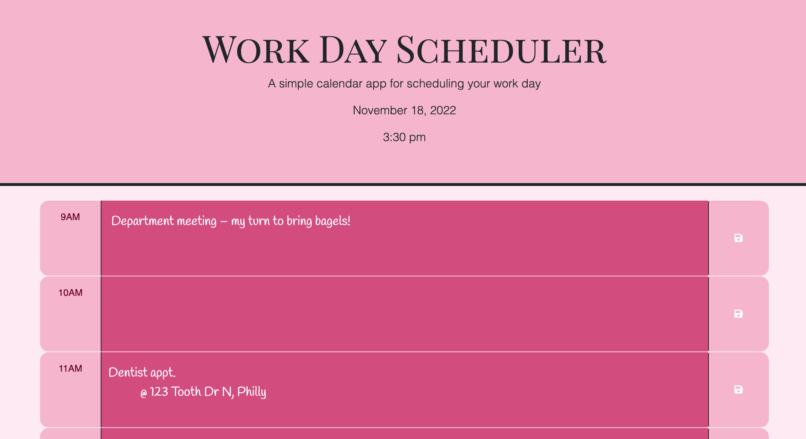

# work-day-scheduler

## Description

This app serves as a great space to save tasks, appointments, or time-senstitive notes. Taking into account the current time and date, the schedule updates throughout the day so that the current hour is always correct. Getting through the workday while maintaining simple, straighforward organization has never been easier!

## Table of Contents (Optional)

- [Installation](#installation)
- [Usage](#usage)
- [Credits](#credits)
- [License](#license)

## Installation

N/A

## Usage

Get organized, use the scheduler [here](https://chelsrunnn.github.io/work-day-scheduler/)

## Credits

N/A

## License

N/A

## How to Contribute
If you have any suggestions or questions about the app, I'd love to hear from you! 

Please reach out to me via email at chelsea.runacres@gmail.com. 